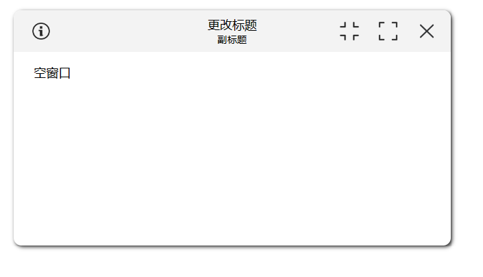

# FloatWindow

- 仿win窗口实现的悬浮窗


# 行为介绍
## 分屏
拖动组件到屏幕或父窗口的边缘，即可分屏。  
触发区域有：
- 屏幕或父窗口左上角
- 屏幕或父窗口右下角
- 屏幕或父窗口左下角
- 屏幕或父窗口右上角
- 屏幕或父窗口左侧边缘
- 屏幕或父窗口右侧边缘
- 屏幕或父窗口底部边缘

## 边缘补齐
当高度或者宽度占大部分的屏幕或父窗口时，拉动悬浮窗边缘的时候，悬浮窗会自动补齐高度或者宽度。
触发区域有：
- 悬浮窗底部边缘
- 悬浮窗左测边缘
- 悬浮窗右测边缘

## 最大化或复原
触发条件有：
- 双击标题栏切换最大化或复原窗口
- 点击标题栏按钮切换最大化或复原窗口
- 悬浮窗往上拖动可切换最大化状态
- 拖动悬浮窗四角边缘，可切换最大化窗口
- 最大化或分屏状态下，拖动标题栏，可复原窗口
- 当悬浮窗小到一定范围时，双击悬浮窗可复原窗口
- 最小化状态下，双击悬浮窗，可复原窗口

## 拖动
拖动标题栏，即可拖动窗口（移动端和PC端拖动范围有一些区别，  
移动端只能拖动标题栏顶端，PC端可以拖动整个标题栏）。  
当悬浮窗小到一定范围时，可直接拖动窗口。

## 缩放
拖动悬浮窗四角边缘，即可缩放窗口。  
触发区域有：
- 悬浮窗左上角
- 悬浮窗右上角
- 悬浮窗左下角
- 悬浮窗右下角
- 悬浮窗顶部（仅PC端）
- 悬浮窗底部
- 悬浮窗左侧
- 悬浮窗右侧

## 悬浮球状态
PC端双击可复原窗口。
移动端单击即可。

# 配置介绍

## 基础用法

在插槽内定义想要显示的内容，并设置标题。

```javascript

<FloatWindow
  title="基础用法">
  自定义内容
</FloatWindow>
```

## 更改标题

通过设置`title`属性，可以更改悬浮窗的标题。

```javascript

<FloatWindow
  title="更改标题"
/>
```


## 副标题

通过设置`subtitle`属性可以更改悬浮窗的副标题。

```javascript

<FloatWindow
  title="更改标题"
  subtitle="副标题"
/>
```



## 更改颜色

可以更改悬浮窗的标题栏等颜色。

```javascript

<FloatWindow
  title="更改颜色"
  title-font-color="white"
  title-bar-background-color="rgba(255, 0, 0, 1)"
/>
```


## 更改样式

可以直接在悬浮窗上增加样式，支持对象和字符串写法。

```vue
<FloatWindow
  title="更改样式"
  :title-bar-center-style="{
        backgroundColor:'rgba(0, 255, 0, 1)'
    }"
  title-bar-right-style='backgroundColor:red'
/>
```


## 自定义悬浮窗内容

```javascript

<FloatWindow
  title="自定义悬浮窗内容">
  自定义内容
</FloatWindow>
```


## 自定义悬浮窗内容(完整展示)
如果覆盖了原有的功能，还可以通过`refs`获取组件实例，然后调用组件的方法。
```vue

<FloatWindow
  title="自定义悬浮窗内容(完整展示)">
    <template
      #titleBarLeft>
      <span>标题栏左侧区域</span>
    </template>
    <template #titleBarCenter>
      <span> 标题栏中心区域 </span>
    </template>
    <template #titleBarRight>
      <span> 标题栏右侧区域 </span>
    </template>
    <template #toolbar>
        工具栏区
    </template>
    <template #leftSidebar>
        左侧边栏
    </template>
    <template #rightSidebar>
        右侧边栏
    </template>
    <template #default>
        默认内容
    </template>
    <template #footer>
        尾栏
    </template>
    <template #floatBall>
        <span>悬浮球</span>
    </template>
</FloatWindow>
```


## 显示网页

通过配置`path`属性并设置`pathType`属性值为`web`，可以在悬浮窗内显示网页(使用的是iframe方案，会有跨域问题)。


```javascript

<FloatWindow
  title="显示网页"
  path-type="web"
  path="https://www.bing.com/"
/>
```


## 加载页面(方案1)
通过设置`pathType`属性值为`router`，可以在悬浮窗内显示子路由的页面(通过router-view方式加载)。  
可以通过`params`属性传递参数给子路由，子路由通过`props`的`params`属性获取传递进来的参数。  
(注意：动态创建的悬浮窗不支持路由模式)
```javascript

<FloatWindow
  title="加载页面(方案1)"
  path-type="router"
/>
```

## 加载路由(方案2)
通过设置`pathType`属性值为`component`或者`view`，并且配置`path`属性，将会加载对应路径下的组件/页面。  
即：  
假如页面位置在 `/src/views/home/index.vue` ,则对应的`pathType`为`view`，`path`为`/home/index`。  
假如页面位置在 `/src/components/home/index.vue` ,则对应的`pathType`为`component`，`path`为`/home/index`。  
可以通过`params`属性传递参数给页面，子页面通过`props`的`params`属性获取传递进来的参数。  
```javascript

<FloatWindow
  title="加载页面(方案2)"
  path-type="view"
  path="/home/index"
/>
```

## 多标签页实践
加上`enableTab`属性，即可开启多标签页功能。  
需要传入`tabs`属性，来定义标签页。  
`tabs`里的具体属性同上。  
```vue
<FloatWindow
  title="多标签页实践"
  enableTab
  :tabs="[
     {
       title: '网页1', 
       path: 'https://www.example.com',
       pathType:'web',
       icon:'',
       closable:true,
       draggable:true
      },
     {
       title: '页面1', 
       path: '/home/index',
       pathType:'view',
       closable:true,
       draggable:true,
       params:{
         a:1,
         b:2
       }
      }]"
/>
```


## 边缘吸附

组件默认开启边缘吸附功能，可以调整`edgeTolerance`属性  
，来定义边缘吸附阈值。

```javascript

<FloatWindow
  title="显示网络图片"
  edge-tolerance="100"
/>
```

## 限制在父窗口内
通过配置`parentLimitation`属性，来定义是否限制在父窗口内。 
注意：组件为动态创建时，父窗口为`document.body`。故该属性不生效。
```javascript

<FloatWindow
  title="限制在父窗口内"
  parentLimitation
/>
```

## 固定在窗口上
通过配置`affixed`属性，来定义是否固定在窗口上。  
`parentLimitation`为`false`才能生效。
```vue

<FloatWindow
  title="限制在父窗口内"
  :parentLimitation="false"
   affixed
/>
```


## 更改默认状态

更改悬浮窗的创建后的初始状态，可以使用`default-window-size-status`属性。

- `minimize`：最小化(即切换为悬浮球)
- `maximize`：最大化
- `normal`：正常
- `hide`：隐藏

```javascript

<FloatWindow
  title="更改默认状态"
  default-window-size-status="minimize"
/>
```

## 禁用某些功能

如果需要禁用某些功能，可以使用`disabled-actions`属性，
对应的功能将会隐藏或禁用。

```javascript

<FloatWindow
  title="禁用某些功能"
  disabled-actions="['minimize','maximize','drag']"
/>
```

## 仅启用某些功能

如果需要只需要某些功能，可以使用`actions`属性，
当`actions`和`disabled-actions`同时存在时，
能使用的功能集为`actions`剔除掉`disabled-actions`的集合。

```javascript

<FloatWindow
  title="启用某些功能"
  actions="['minimize','maximize','drag']"
/>
```

### 功能集

- `minimize`：最小化(即切换为悬浮球)
- `maximize`：最大化
- `restore`：还原
- `drag`：拖拽
- `resize`：调整悬浮窗大小
- `stickToEdges`：边缘吸附
- `close`：关闭
- `hide`：隐藏
- `show`：显示
- `splitScreen`：分屏
- `top`：置顶
- `zoomIn`: 放大
- `zoomOut`: 缩小

## 动态创建

可以动态创建悬浮窗，以方便全局使用和管理。

```javascript
  const floatWindow = await this.$floatWindow({
  title: new Date().getTime().toString(),
  subtitle: '副标题',
  subtitleFontColor: 'red'
})

// 调用各种方法
const id = await floatWindow.getFloatWindowId()
console.log(id)

// await floatWindow.show()
// await floatWindow.hide()
// await floatWindow.updateWindowSize({ newWidth:300, newHeight:300 })
// await floatWindow.updateWindowPosition({ newX:50, newY:50 })
// await floatWindow.handleMaximize()
// await floatWindow.handleMinimize()
// await floatWindow.closeWindow()
```

---

## FloatWindow 属性

| 参数                      | 类型            | 默认值                                                                                                                | 可选值                                                       | 描述                                   |
|-------------------------|---------------|--------------------------------------------------------------------------------------------------------------------|-----------------------------------------------------------|--------------------------------------|
| defaultPosition         | object        | { x: '20vw', y: '20vh' }                                                                                           | -                                                         | 窗口的默认位置(支持px,vw,vh,%单位)              |
| defaultWindowSizeStatus | string        | 'normal'                                                                                                           | 'normal','minimize','maximize','hide'                     | 默认窗口大小状态                             |
| defaultSize             | object        | { width: '50vw', height: '50vh' }                                                                                  | -                                                         | 窗口的默认尺寸(支持px,vw,vh,%单位)              |
| backgroundColor         | string        | '#fff'                                                                                                             | -                                                         | 窗口背景颜色                               |
| minSize                 | object        | { width: '20vw', height: '20vh' }                                                                                  | -                                                         | 窗口允许调整的最小尺寸(支持px,vw,vh,%单位)          |
| maxSize                 | object        | { width: '110vw', height: '110vh' }                                                                                | -                                                         | 窗口允许调整的最大尺寸(支持px,vw,vh,%单位)          |
| titleBarHeight          | number/string | '10vh'                                                                                                             | -                                                         | 标题栏的高度(支持px,vw,vh,%单位)               |
| titleBarBackgroundColor | string        | '#f3f3f3'                                                                                                          | -                                                         | 标题栏的背景颜色                             |
| titleBarStyle           | object/string | -                                                                                                                  | { backgroundColor: '#f3f3f3' }或backgroundColor: '#f3f3f3' | 标题栏的样式                               |                                     | 标题栏的样式             |
| title                   | string        | '悬浮窗'                                                                                                              | -                                                         | 窗口标题                                 |
| titleFontSize           | number        | 20                                                                                                                 | -                                                         | 标题字体大小                               |
| titleFontColor          | string        | '#000'                                                                                                             | -                                                         | 标题字体颜色                               |
| subtitle                | string        | -                                                                                                                  | -                                                         | 窗口副标题                                |
| subtitleFontSize        | number        | 14                                                                                                                 | -                                                         | 副标题字体大小                              |
| subtitleFontColor       | string        | '#000'                                                                                                             | -                                                         | 副标题字体颜色                              |
| titleBarLeftStyle       | object/string | -                                                                                                                  | { backgroundColor: '#f3f3f3' }或backgroundColor: '#f3f3f3' | 标题栏左侧区域样式                            |
| titleBarCenterStyle     | object/string | -                                                                                                                  | { backgroundColor: '#f3f3f3' }或backgroundColor: '#f3f3f3' | 标题栏中央区域样式                            |
| titleBarRightStyle      | object/string | -                                                                                                                  | { backgroundColor: '#f3f3f3' }或backgroundColor: '#f3f3f3' | 标题栏右侧区域样式                            |
| ballHeight              | number/string | 40                                                                                                                 | -                                                         | 悬浮球高度(支持px,vw,vh,%单位)                |
| ballWidth               | number/string | 40                                                                                                                 | -                                                         | 悬浮球宽度(支持px,vw,vh,%单位)                |
| ballStyle               | object/string | -                                                                                                                  | -                                                         | 悬浮球样式                                |
| edgeTolerance           | number/string | 100                                                                                                                | -                                                         | 边缘吸附阈值(支持px,vw,vh,%单位)               |
| actions                 | array         | ['drag', 'resize', 'stickToEdges', 'minimize', 'maximize', 'restore','hide', 'show', 'close', 'splitScreen','top'] | -                                                         | 开放的功能                                |
| disabledActions         | array         | []                                                                                                                 | -                                                         | 禁用的功能                                |
| path                    | string        | null                                                                                                               | -                                                         | 窗口内容路由参数（不为空则加载路由）                   |
| pathType                | string        | 'none'                                                                                                             | 'web','component','view','router'                         | 路由类型                                 |                                                 |                                      |
| params                  | object        | {}                                                                                                                 | -                                                         | 传递给子页面的参数                            |
| parentLimitation        | boolean       | true                                                                                                               | -                                                         | 是否限制在父div里拖动                         |                                                                                                                 | -                                                         | 是否限制在父div里拖动                         |
| affixed                 | boolean       | false                                                                                                              | -                                                         | 是否固定在屏幕上(parentLimitation为false才能生效) |
| tabs                    | array         | []                                                                                                                 | -                                                         | 窗口标签页属性                              |
| enableTab               | boolean       | false                                                                                                              | -                                                         | 是否开启标签页功能                            |
| newTab                  | object        | {  title: '新标签页',icon: '',path: '/',params: {},pathType: 'none', closable: true,draggable: true}                   | -                                                         | 指定新标签页                               |

---

## FloatWindow Slot

| 名称             | 描述      |
|----------------|---------|
| floatBall      | 悬浮球内容   |
| titleBar       | 标题栏     |
| titleBarLeft   | 标题栏左侧区域 |
| titleBarCenter | 标题栏中央区域 |
| titleBarRight  | 标题栏右侧区域 |
| toolbar        | 工具栏     |
| leftSidebar    | 左边栏     |
| rightSidebar   | 右边栏     |
| footer         | 底栏      |
| default        | 窗口内容    |

---

## FloatWindow 方法

### getFloatWindowId

- 详情： 获取窗口id

### show

- 详情： 展示窗口

### hide

- 详情： 隐藏窗口

### updateWindowSize

- 详情： 更新窗口大小

| 参数        | 类型                  | 默认值 | 描述      |
|-----------|---------------------|-----|---------|
| newWidth  | <code>number</code> | -   | 最新的窗口宽度 |
| newHeight | <code>number</code> | -   | 最新的窗口高度 |

### updateWindowPosition

- 详情： 更新窗口位置

| 参数   | 类型                  | 默认值 | 描述     |
|------|---------------------|-----|--------|
| newX | <code>number</code> | -   | 最新的x坐标 |
| newY | <code>number</code> | -   | 最新的y坐标 |

### handleMaximize

- 详情： 最大化窗口

### handleMinimize

- 详情： 最小化窗口

### handleRestore

- 详情： 复原窗口

### handleTop

- 详情： 置顶窗口

### handleZoomIn

- 详情： 放大窗口内容

### handleZoomOut

- 详情： 缩小窗口内容

### closeWindow

- 详情： 关闭窗口

### handleCloseTab

- 详情： 关闭标签页

| 参数    | 类型                  | 默认值 | 描述    |
|-------|---------------------|-----|-------|
| index | <code>number</code> | -   | 标签页索引 |

### handleTabClick

- 详情： 切换tab页

| 参数    | 类型                  | 默认值 | 描述    |
|-------|---------------------|-----|-------|
| index | <code>number</code> | -   | 标签页索引 |

### handleAddTab

- 详情： 添加tab页，需要指定`newTab`属性


---

## 事件

| 名称                  | 描述                                                 | 回调参数                                                                                                                                                                                                                                                                                                                                                                               |
|---------------------|----------------------------------------------------|------------------------------------------------------------------------------------------------------------------------------------------------------------------------------------------------------------------------------------------------------------------------------------------------------------------------------------------------------------------------------------|
| clickFloatWindow    | 点击悬浮窗时调用                                           | -                                                                                                                                                                                                                                                                                                                                                                                  |
| clickFloatBall      | 点击悬浮球时调用                                           | -                                                                                                                                                                                                                                                                                                                                                                                  |
| rightClickFloatBall | 右点击悬浮球时调用                                          | -                                                                                                                                                                                                                                                                                                                                                                                  |
| startDrag           | 开始拖动悬浮窗时调用                                         | <code>x</code>：<code>number</code> 起始位置x; <code>y</code>：<code>number</code> 起始位置y;                                                                                                                                                                                                                                                                                                |
| stopDrag            | 停止拖动悬浮窗时调用                                         | <code>nowX</code>：<code>number</code> 现在位置x; <code>nowY</code>：<code>number</code> 现在位置y;                                                                                                                                                                                                                                                                                          |
| startResize         | 开始调整悬浮窗大小时调用                                       | <code>nowX</code>：<code>number</code> 现在位置x; <code>nowY</code>：<code>number</code> 现在位置y; <code>direction</code>：<code>string</code> 方向;                                                                                                                                                                                                                                           |
| resize              | 调整悬浮窗大小时调用                                         | <code>oldX</code>：<code>number</code> 调整前位置x; <code>oldY</code>：<code>number</code> 调整前位置y; <code>oldWidth</code>：<code>number</code> 调整前宽; <code>oldHeight</code>：<code>number</code> 调整前高;  <code>newX</code>：<code>number</code> 现在位置x; <code>newY</code>：<code>number</code> 现在位置y; <code>newWidth</code>：<code>number</code> 宽; <code>newHeight</code>：<code>number</code> 高; |
| stopResize          | 停止调整悬浮窗大小时调用                                       | <code>x</code>：<code>number</code> 现在位置x; <code>y</code>：<code>number</code> 现在位置y; <code>width</code>：<code>number</code> 宽; <code>height</code>：<code>number</code> 高;                                                                                                                                                                                                           |
| windowStatusChange  | 悬浮窗状态改变时调用                                         | <code>status</code>：<code>string</code> 窗口状态;                                                                                                                                                                                                                                                                                                                                      |
| dblclickFloatBall   | 双击悬浮球时调用                                           | -                                                                                                                                                                                                                                                                                                                                                                                  |
| closeWindow         | 关闭悬浮窗时调用                                           | -                                                                                                                                                                                                                                                                                                                                                                                  |
| outsideClick        | 点击悬浮窗外部时调用                                         | -                                                                                                                                                                                                                                                                                                                                                                                  |
| beforeClose         | 关闭前的回调，会暂停悬浮窗的关闭. 回调函数内执行 done 参数方法的时候才是真正关闭对话框的时候 | <code>done</code>：<code>function</code> 关闭悬浮窗                                                                                                                                                                                                                                                                                                                                      |
